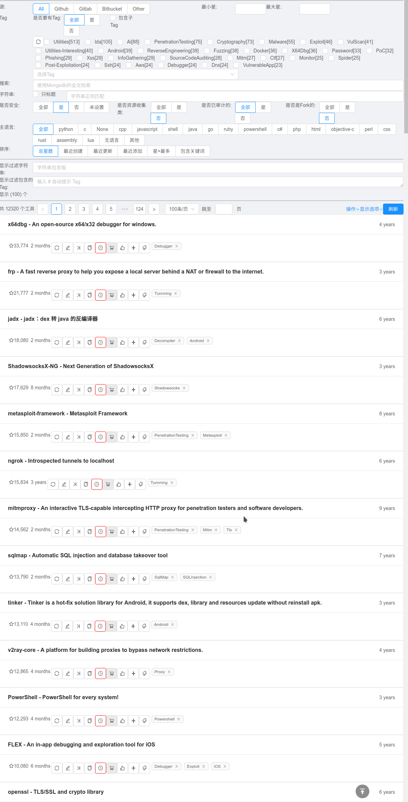

# 网安图书馆

## 简要说明
- 从近2000个网络安全相关的资讯、博客站点中爬取的文章，并对文章内容进行分类/内容提取与加工/索引等操作
- 文章搜索: 可从多个维度对文章进行搜索, 包括:
  - 所属站点
  - 文章链接
  - 文章类型: 恶意代码/漏洞/漏洞披露/CTF/攻防/报告/代码与工具/其他/未设置
  - 文章时间: 发布时间/添加时间/审计时间
  - 为文章附加的Tag
  - 文章是否有翻译原文/翻译译文(数据库中)
  - 文章内容中包含的关键词
  - 文章内容中包含的Hash值
  - 可排序方式: 文章时间/字数/图片数/内容包含的关键词数目
- 开源工具: 从文章内容中提取开源站点的链接, 验证后添加为工具. 工具可按以下维度进行搜索:
  - 源: github/gitlab/bitbucket/sourceforge
  - 为工具附加的Tag
  - 关键词: 全文匹配/正则匹配
  - 是否设置了如下属性: 与安全相关、资源收集类型、是否是Fork的
  - 主语言
  - 可排序方式: 星数/创建时间/更新时间/添加时间
- Hash值搜索: 从文章内容/链接中提取hash值, 到VT等网站验证, 在结合文章内容手动设置Hash值所属的样本家族(前端代码被去除)

## 子项目
- 后端: [xrkk/cbr-backend](https://github.com/xrkk/cbr-backend)
- 前端: [xrkk/cbr-web](https://github.com/xrkk/cbr-web)

## 截图
- 文章搜索: 
- 工具搜索: 

## 示例
- 按文章内容包含的关键词搜索的部分结果([完整列表 - 260+](posts/cc_sum.md)):

| 文章数目 | Key/Alias | 按CC数目排序 | 按文章时间排序 |
| ------- | --------- | ---------- | ------------|
| 144 | AFLfuzzer | [Link](posts/cc/AFLfuzzer_post_sort_by_cc_cnt.md) | [Link](posts/cc/AFLfuzzer_post_sort_by_time.md) |
| 24 | Anti-AV[免杀] | [Link](posts/cc/Anti-AV_post_sort_by_cc_cnt.md) | [Link](posts/cc/Anti-AV_post_sort_by_time.md) |
| 18 | Anti-Analysis | [Link](posts/cc/Anti-Analysis_post_sort_by_cc_cnt.md) | [Link](posts/cc/Anti-Analysis_post_sort_by_time.md) |
| 116 | Anti-Debug[反调试] | [Link](posts/cc/Anti-Debug_post_sort_by_cc_cnt.md) | [Link](posts/cc/Anti-Debug_post_sort_by_time.md) |
| 44 | Anti-Disassemble | [Link](posts/cc/Anti-Disassemble_post_sort_by_cc_cnt.md) | [Link](posts/cc/Anti-Disassemble_post_sort_by_time.md) |
| 13 | Anti-Forensic | [Link](posts/cc/Anti-Forensic_post_sort_by_cc_cnt.md) | [Link](posts/cc/Anti-Forensic_post_sort_by_time.md) |
| 15 | Anti-VM[Anti-Sandbox] | [Link](posts/cc/Anti-VM_post_sort_by_cc_cnt.md) | [Link](posts/cc/Anti-VM_post_sort_by_time.md) |

- 高星工具部分列表(非收集类)([完整列表 - 1W+](tools/tool_list.md)):

| 星数 | 最近更新 | 名称 | 描述 |
| --- | ------- | --- | --- |
| 33774 | 2019.03.28 | [x64dbg/x64dbg](https://github.com/x64dbg/x64dbg) | An open-source x64/x32 debugger for windows. |
| 21777 | 2019.03.26 | [fatedier/frp](https://github.com/fatedier/frp) | A fast reverse proxy to help you expose a local server behind a NAT or firewall to the internet. |
| 18080 | 2019.04.03 | [skylot/jadx](https://github.com/skylot/jadx) | Dex to Java decompiler |
| 17629 | 2018.10.02 | [shadowsocks/shadowsocksx-ng](https://github.com/shadowsocks/shadowsocksx-ng) | Next Generation of ShadowsocksX |
| 15850 | 2019.04.04 | [rapid7/metasploit-framework](https://github.com/rapid7/metasploit-framework) | Metasploit Framework |

- 高星工具部分列表(收集类)([完整列表 - 360+](tools/tool_collection_list.md)):

| 星数 | 最近更新 | 名称 | 描述 |
| --- | ------- | --- | --- |
| 32280 | 2018.11.16 | [minimaxir/big-list-of-naughty-strings](https://github.com/minimaxir/big-list-of-naughty-strings) | The Big List of Naughty Strings is a list of strings which have a high probability of causing issues when used as user-input data. |
| 27716 | 2018.10.25 | [hack-with-github/awesome-hacking](https://github.com/hack-with-github/awesome-hacking) | A collection of various awesome lists for hackers, pentesters and security researchers |
| 20748 | 2018.12.12 | [mathiasbynens/dotfiles](https://github.com/mathiasbynens/dotfiles) |  |
| 17892 | 2017.02.20 | [fallibleinc/security-guide-for-developers](https://github.com/fallibleinc/security-guide-for-developers) | Security Guide for Developers (实用性开发人员安全须知) |
| 16232 | 2019.01.08 | [danielmiessler/seclists](https://github.com/danielmiessler/seclists) | SecLists is the security tester's companion. It's a collection of multiple types of lists used during security assessments, collected in one place. List types include usernames, passwords, URLs, sensitive data patterns, fuzzing payloads, web shells, and many more. |

# 安装

## `Mongodb`
- [安装](https://docs.mongodb.com/manual/installation/)
- `mongod --port 27029`: 启动, 使用端口`27029`
- [下载 cbr_mongodb_dump.tar.gz](https://mega.nz/#!fKAwGAAS!JC2i_kp-2rlKEz0ImYYV6tLl5dP-JihCCK2lDmcHLfk)数据
- `tar -xzf cbr_mongodb_dump.tar.gz`: 解压
- `mongorestore --port 27029 --nsInclude 'posts.*' --dir xxx_dir --gzip -vvvvvv --drop`: 导入

## 后端
- `git clone https://github.com/xrkk/cbr-backend`
- `cd cbr-backend`
- `virtualenv -p python3 .`
- `source bin/activate && cd src`
- `pip install -r requirements.txt`
- 代码中搜索`27029`, 配置`MongoDB`数据库的端口(主机/认证等)
- `python main.py`: 运行. 默认端口`5000`

## 前端
- 安装`nodejs && npm`
- `git clone https://github.com/xrkk/cbr-web`
- `cd cbr-web`
- `npm i`
- 编辑`environment.ts/environment.prod.ts`, 修改后端地址(默认: http://127.0.0.1:5000)
- `ng serve`: 使用默认端口`4200`
- 浏览器打开`http://127.0.0.1:4200`
